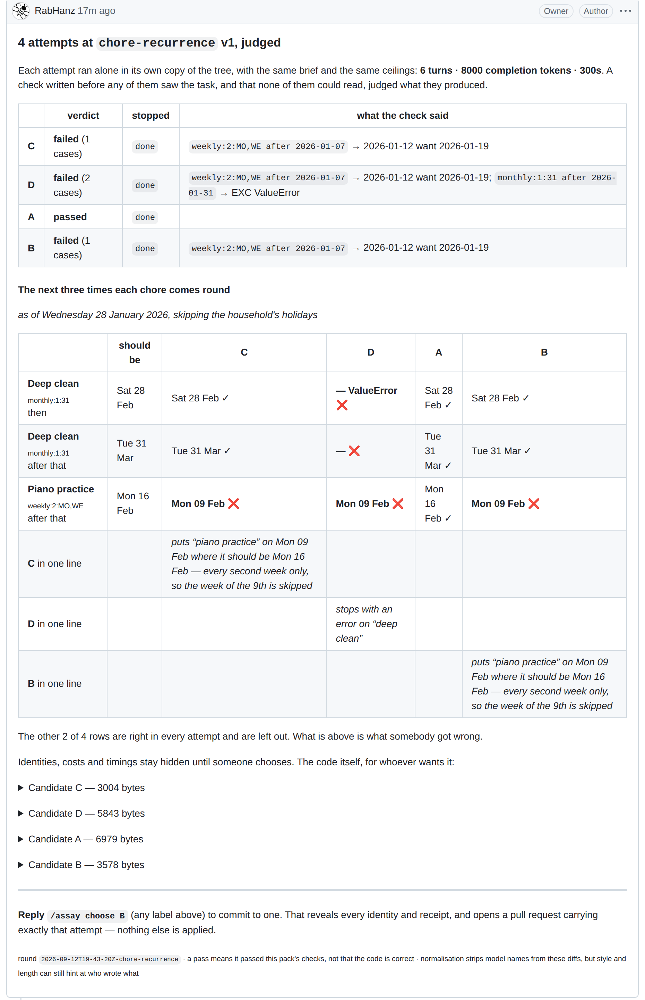
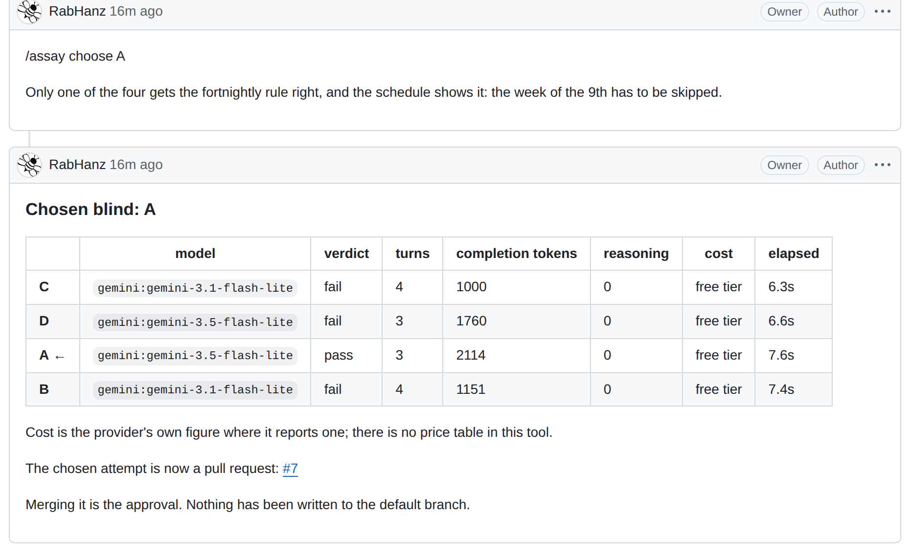

# Assay

You have a real task in your own codebase, and several models that claim they can do it. You want to know which one actually can, before you trust it with your work.

Every leaderboard answers a different question. They rank models on somebody else's problems. Assay ranks them on yours, and it finishes with the work done rather than with a score.



That is a comment on a GitHub issue, exactly as it renders. Four models attempted the same task alone. A check none of them could read judged the results. The board shows what each attempt's code **produces** — a household's chore schedule — against what it should produce, and only the rows somebody got wrong. No model names until the choice is made. Read it at [issue #6](https://github.com/RabHanz/assay/issues/6).

## It happens in your repository

You do not go anywhere to use this. The whole loop is an issue thread and a pull request.

1. **Someone opens an issue** about the thing that is wrong, and adds the `assay` label.
2. **Each model works alone** in its own copy of the tree, through a real tool loop, with the same
   brief and the same ceilings.
3. **A check judges what they produced.** It was written before any of them saw the task and it
   never enters their workspace, so no model can read the cases grading it or overwrite its grader.
4. **The board arrives as a comment**: what each attempt produced, against what it should have
   produced, the cells they got wrong marked, and one plain sentence per attempt naming the mistake.
   The code is there too, folded, for whoever wants it. No model names, no costs, no timings.
5. **Someone with write access replies** `/assay choose B`. That is the decision. Nothing else can
   make it, and a comment from anyone else changes nothing.
6. **The reveal posts next** — who was who, with every receipt — and a **pull request opens**
   carrying exactly that attempt, with the schedule it produces in its body.
7. **You merge it.** The approval is the act your repository already had. Nothing here ever merges.



Columns A and D were the same model. It passed once and crashed once, on the same task, in the same minute, under identical ceilings. A leaderboard that ranked it off one run would have been right by luck. That is why the board shows outcomes and the [scoreboard](SCOREBOARD.md) shows pass rates with their n.

## Three things that happened on this repository

- **[Issue #14](https://github.com/RabHanz/assay/issues/14)** went from one label to an open pull
  request in 3 minutes 23 seconds, with no human action in between except the choice. The
  workflow ran on GitHub's own runners; nothing of ours ran anywhere.
- **On that round the free model won.** The blind choice, made on the board alone, landed on
  Gemini's free tier, which finished cleanly in ten seconds. Of the two paid attempts beside it,
  one also passed but ran to its token ceiling on the last step, and one spent its entire budget
  reasoning and wrote nothing. The receipts say what each cost. Paying did not buy the right
  answer that time, and the only reason anyone could know that is that the task was theirs.
- **Five bugs in this tool were found by running it and none by reading it**: a relative path
  graded as a model failure; a passing file hidden behind an "empty" label; a choice lost to a
  restart; the untouched fixture rendered as a candidate's own work; and a secret pasted with its
  quotes, so the runner sent an invalid header. Each was the tool's bookkeeping disagreeing with
  what had actually happened.

## Put it in your repository

Two steps, not one:

1. Copy [`.github/workflows/assay.yml`](.github/workflows/assay.yml) into your repository.
2. Add one model key as a repository secret. `GEMINI_API_KEY` is enough and its free tier carries
   the defaults; `OPENROUTER_API_KEY` adds every model OpenRouter serves.

Then put a pack under `packs/` (or `python -m assay init <name>` writes one that already passes,
so the real job is editing two files), and label an issue. An issue that names no pack gets the
repository's pack; no `models:` line means three free attempts.

The workflow runs under GitHub's own token. Comments are authored by that token; the only
identity it ever *checks* is the commenter's, against the repository's real permissions, before
anything else in the job happens.

## Try it without GitHub

```bash
python -m assay demo            # one free key in keys.local, one command, the board in your terminal
python -m assay repeat packs/chore-recurrence --models a,b --n 5    # pass rates, not a verdict
python -m assay init split-the-invoice                              # a pack that already passes
```

Python 3.12, standard library only. `gh` for the GitHub loop.

## A pack is a portable artefact

```
packs/<name>/
  pack.toml     name, version, entrypoint, and the three ceilings
  brief.md      the only thing a model is told
  fixture/      the starting tree, copied into each workspace
  check.py      the acceptance check. Never copied into a workspace.
  outcome.py    what an attempt's work PRODUCES, for a reader who does not read code. Optional.
```

Two packs ship: `chore-recurrence` (dates: recurrence rules, holiday roll-forward, month-end
clamping) and `split-the-bill` (money: shares that must add back up to the bill, to the penny —
a naive split prints £99.99 under a £100.00 bill). Take either, point it at the model that was
announced this morning, and see what it does with your own task in minutes.

## Reading the outcomes

Four outcomes, deliberately kept apart, because collapsing them is how a scoreboard starts lying:

- **pass / fail** — passed these checks. Not a proof of correctness.
- **no artefact** — the model never wrote the file. Running out of budget is not a wrong answer,
  and this project shipped a bug that showed it as one until the first real run caught it.
- **empty output** — the model spent its whole budget and returned nothing, billed in full.
- **transport error** — the provider failed. Not the model's fault, retried before it is recorded.

Every receipt carries completion tokens, reasoning tokens, cost and elapsed time as reported by the provider itself, never estimated from a price table. Turns, tokens and wall-clock are three separate ceilings enforced by the host, and the board always says which policy it ran under, because a token ceiling is a judging policy rather than a neutral setting.

## One round is a sample, not a verdict

Two models, the same pack, the same ceilings, five runs each:

```
 passed     tokens min–max  median  model
   3/5             951–2015    1165  gemini-3.1-flash-lite
   2/5            1288–2715    1439  gemini-3.5-flash-lite
```

Every run finished cleanly. The same model solves the task on some attempts and not others.
`assay repeat` reports a pass rate, the token spread, and every distinct failing case each model
produced; the committed [scoreboard](SCOREBOARD.md) accumulates every round this repository runs.

## The token ceiling is a judging policy

```
 passed     tokens min–max  model            ceiling
   0/3            7076–8000  qwen3.7-flash     8,000
   0/3           14020–16000 qwen3.7-flash    16,000
```

Doubling the budget bought twice the spending and the same verdict. `--max-tokens` overrides a
pack's budget and writes the override into the board's policy line.

## What already exists, and what does not

Running several models on one task in isolation and applying the winner is not new. Cursor ships
`/best-of-n`: the same task across multiple models, each in its own worktree, then
`/apply-worktree` to land the one you pick ([docs](https://cursor.com/docs/configuration/worktrees));
their own words are that it "compares runs only". GitHub's Agent HQ assigns one issue to Copilot,
Claude and Codex together and lets you compare their pull requests. Harbor and promptfoo run
sandboxed agent evaluations against hidden checks.

Three things none of them do:

1. **Nobody hides which model is which.** Here you choose before you know.
2. **Nobody puts a pre-written test in the selection seat.** Here a check that predates every
   attempt decides what can be chosen at all.
3. **Nobody shows what the code does.** Every one of them compares source.

GitHub already argues the third point: it renders prose with source and rendered views, turns a CSV
into a table, and ships two-up, swipe and onion-skin for image diffs. It treats the rendered
artefact as primary everywhere except code.

## What this is not

Not a universal ranking. Sample sizes are shown as they are. A public board publishes that pack's
expected values, so a public round spends its hidden cases; packs are cheap and meant to be
replaced, and what matters is that the check predates every attempt. Whether anyone will pay for
this is untested.

## Prior work

`assay/pack.py` and `assay/judge.py` were drafted before the hackathon window and never run; a
throwaway harness (not in this repo) measured six models on the recurrence task before the
window and is the reason the pack exists. Everything else here was written inside the window.

Built by Rabee Hanzla.
